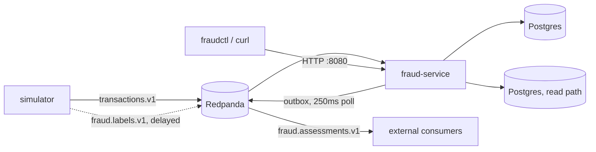

# Architecture Overview

## The shape of the pipeline

Three binaries, one shared `internal/` library:

- **`simulator`** publishes mock transactions to `transactions.v1`, then publishes each one's ground-truth fraud label to `fraud.labels.v1` after a configurable delay.
- **`fraud-service`** is the daemon: it consumes both topics, scores transactions, persists everything to Postgres, and republishes assessments via an outbox. It also serves the HTTP API.
- **`fraudctl`** is a thin, read-only CLI over that HTTP API.

`internal/` is organized one package per concern, with dependencies flowing inward toward `domain`:

- `domain` — event/record types and validation. No dependency on any other internal package.
- `features` — turns a transaction + history into a `FeatureVector`.
- `model` — loads a versioned logistic-regression artifact and scores a `FeatureVector`.
- `policy` — maps a score to a recommended action via thresholds.
- `service` — orchestration: `Processor` (ties features + model + policy + storage together), `Outbox` (publishes persisted assessments), `Metrics` (Prometheus registrations).
- `store` — Postgres persistence, including the schema migration and all SQL.
- `stream` — Kafka producer/consumer built on `franz-go`.
- `httpapi` — the HTTP server.

## Why transactions are keyed by account

Kafka partitions are processed concurrently — `stream.Consumer` runs a worker pool keyed by `partition % workers` — but records *within* one partition are handled and committed strictly in order. Both the simulator and any real producer key `transactions.v1` records by account ID, so every event for a given account lands in the same partition and is therefore processed in order relative to that account's history, even while different accounts' events are scored in parallel.

## Why there's an outbox instead of publishing directly

`fraud-service` never publishes `fraud.assessments.v1` directly from the request path. Instead, `Postgres.Evaluate` writes the assessment *and* an outbox row in the same database transaction, and a separate `service.Outbox` loop polls for unpublished rows every 250ms and publishes them. This decouples the database commit from the Kafka publish: neither can succeed without the other eventually happening, and a crash between "commit" and "publish" just means the outbox loop catches up on restart — nothing is silently lost or double-counted at the DB layer. See [Delivery Guarantees and Idempotency](delivery-guarantees-and-idempotency.md) for the full mechanics.

## Why labels are a separate topic and consumer group

`fraud.labels.v1` is consumed by an entirely separate consumer group (`fraud-label-evaluator-v1`) than the one scoring transactions (`fraud-scorer-v1`). The scoring code path has no way to read a label even if it wanted to — this is a structural guarantee against label leakage, not just a convention. See [Scoring and Explainability](scoring-and-explainability.md).

## What's deliberately out of scope

No authentication, no real payment authorization, a single local Kafka broker, and hand-authored (not trained) model weights. See [Design Decisions and Testability](design-decisions-and-testability.md) for the full rationale.
